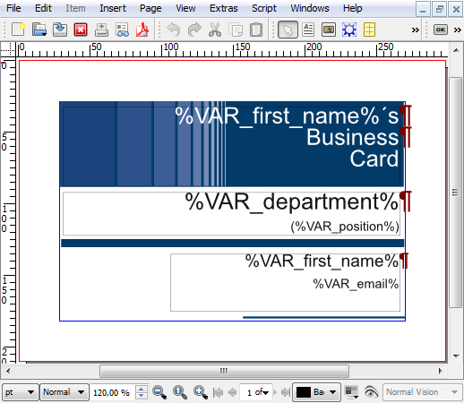
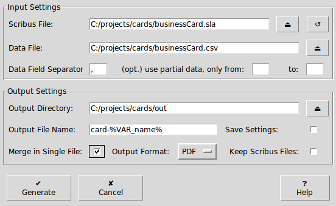
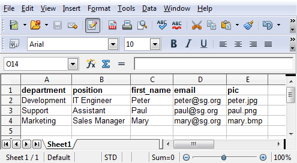

ScribusGenerator
================

Mail-Merge-like extension to Scribus, to generate Scribus and pdf documents automatically from external data.

What about Scribus?
--------

[Scribus](http://www.scribus.net/) is a desktop publishing (DTP) application, which is free software and released under the GNU General Public License ([http://www.scribus.net](http://www.scribus.net/)).

It is available for Linux, Unix-like, Mac OS X, OS/2, and Microsoft Windows. Known for its broad set of page layout features, it is comparable to leading non-free applications such as Adobe PageMaker, PagePlus, QuarkXPress or Adobe InDesign.

Scribus is designed for flexible layout and typesetting and the ability to prepare files for professional quality image setting equipment. It can also create animated and interactive PDF presentations and forms. Example uses include writing small newspapers, brochures, newsletters, posters and books.

What about Scribus Generator?
-------

Scribus comes with a broad set of page layout features and functionality. One feature missing is to replace text with data dynamically. This kind of feature you may already know as the typical __mail merge__ functionality in your preferred office application.

**Scribus Generator** fills this lack of functionality. **Scribus Generator** in general is an extension to replace text with data to automatic generated files (e.g. SLA, PDF). It has been written by [Will Ekkehard](http://www.ekkehardwill.de/sg/) and further improved upon by [Berteh](https://github.com/berteh/).

**Scribus Generator** is implemented as a Python script. It simply can be started by choosing the script (``ScribusGenerator.py``) within the dialog: _«Scribus → Script → Execute Script»_.

The script can be placed anywhere on the local machine. It can also be placed where the default extension scripts are located. For example on Windows platform the location would be ``SCRIBUS_HOME\share\scripts\``, where ``SCRIBUS_HOME`` is the Scribus installation directory.

What about Scribus file?
------

Create and design your Scribus file as any other. At the positions where you need to replace text with data, just add ``%VAR_name%`` where ``name`` is the column in the data table.

You can place the variable at any position within a Text Frame. Apply all format and style to the variable as it would be the concerning original text.

What about Data File?
--------

**Scribus Generator** expects a CSV file (_Comma Separated Values_), which is very simple to create. Open a spread sheet editor, enter the data and save/export as CSV. UTF-8 encoding is recommended.

As you can see, the columns have the same ``name`` as variables (``%VAR_name%``) referenced in the Sribus file you have designed.

What about Settings?
---------

In the dialog you can configure the input and output settings for **Scribus Generator**.

| Setting | explanation |
| ---- | ---- |
| *Scribus File* | Choose the Scribus File containing the variables to replace. |
| *Data File* | Choose the Data File containing the comma separated values. |
| *Output Directory* | Choose the path to an existing directory where to save the result. |
| *Output File Name* | You can use the same variables as defined in the Scribus File/Data File. You can also mix the variables with other characters. If you leave the field empty an index will be used. The index/resulting files will be sorted according to the occurrence of rows in the Data File. |
| *Ouput Format* | Choose the Output Format of the generated files, e.g. PDF. |
| *Keep Scribus Files* | Choose whether to keep the generated Scribus Files. Otherwise they will be deleted after generation and only the files in the specified output format will be kept.|

What about Images?
------------

Images can also be referenced so they dynamically will be rendered with **Scribus Generator**. All images supported by **Scribus** can be used. However, there are preconditions:

*   There will have to be defined exactly one folder containing the images (this folder can be located anywhere on PC).

Add an Image Frame anywhere in the Scribus file (_«Scribus → Insert → Insert Image Frame»_) and open the dialog for getting an image (_e.g. right click Image Frame → Get Image..._ on selected frame). Within the dialog navigate to the folder containing the images, though there won't be any images selected. Instead, the variable will be inserted into the value field of the _File name_.

After confirming the dialog, there isn't displayed a picture in the Image Frame, however the variable name can be seen.

The images can be defined as any other variable described in previous sections. There just has to be a column with column-name corresponding to variable-name in the Scribus file.

Issues
-------

### Variable Names

If possible, use plain characters (ASCII) for variable names and do not use whitespaces and other special characters (like '&'). E.g. use ``%VAR_first_name%`` and ``%VAR_zip_code%`` instead of ``%VAR_first name%`` and ``%VAR_&zip#code%``.
The columns of the data file (CSV) then would be ``first_name</var> and ``zip_code``.		

**Note**: This is only important for variable names in the scribus file and column names of the data file. The data FIELDS (the rows of the CVS) of course may contain ANY characters.

Licence
--------

The MIT License
Copyright 
(c) from 2011 to 2014, Ekkehard Will, (www.ekkehardwill.de), 
(c) 2014, Berteh (https://github.com/berteh/),

Permission is hereby granted, free of charge, to any person obtaining a copy of this software and associated documentation files (the "Software"), to deal in the Software without restriction, including without limitation the rights to use, copy, modify, merge, publish, distribute, sublicense, and/or sell copies of the Software, and to permit persons to whom the Software is furnished to do so, subject to the following conditions: 

The above copyright notice and this permission notice shall be included in all copies or substantial portions of the Software. 

The software is provided "as is", without warranty of any kind, express or implied, including but not limited to the warranties of merchantability, fitness for a particular purpose and noninfringement. In no event shall the authors or copyright holders be liable for any claim, damages or other liability, whether in an action of contract, tort or otherwise, arising from, out of or in connection with the software or the use or other dealing in the software.
